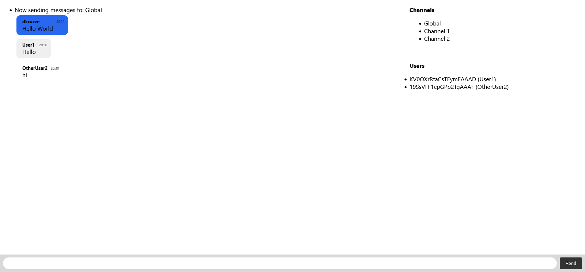
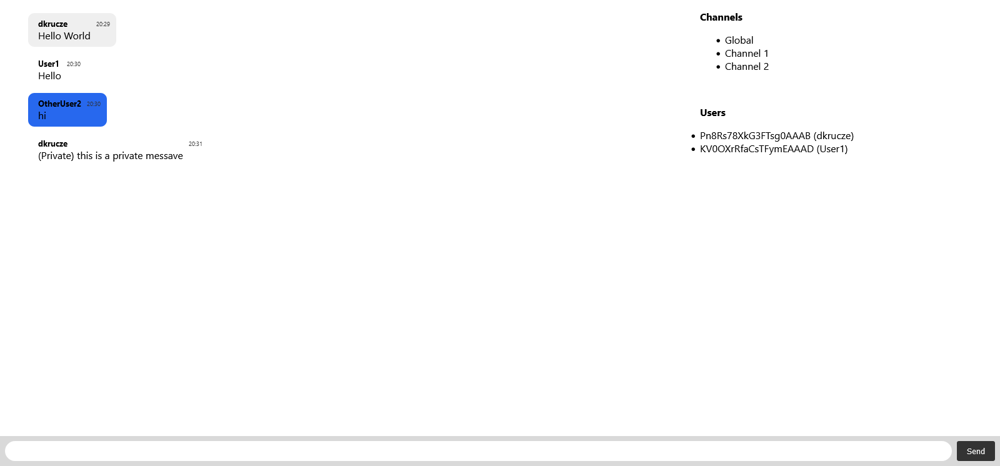

# Socket.IO chat example

Demo application to show funcionalities of Socket.IO library. It allows for basic communication like messages to channels, private messaging, switching channels.
Next to list of users are displayed their socket ID's to show that for each instance new socket is created.

## Screenshots

## Features

- Changing channels
- Private messaging
- Real time communication

## Technologies

- JavaScript
- [Socket.IO](https://socket.io/)
- Node.js

## Authors

- [@dkrucze](https://github.com/TheKiromen)
- [@pawelus70](https://github.com/pawelus70)
- [@Trodaire98](https://github.com/Trodaire98)
